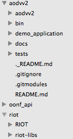

# AODVv2 for RIOT OS
This implementation is work in progress. It is in no way complete. You can find a description of the subset of the [AODVV2 Draft](http://tools.ietf.org/id/draft-ietf-manet-aodvv2) I implemented so far at ``docs/aodvv2_minimal.txt``. 

## setup
The applications will only work out of the box with the following directory structure:

(Otherwise, you'll have to readjust the paths in all Makefiles)

### dependencies
you will need to clone the following projects and store them in the structure shown above

- [my RIOT OS fork; branch build-aodv](https://github.com/Lotterleben/RIOT)
- [the oonf api port to RIOT OS](https://github.com/Lotterleben/oonf_api)
- [riot-libs](https://github.com/Lotterleben/riot-libs)

## usage
You can find a small demo application using aodvv2 in ``aodvv2/demo_application``.
To use it, run the following commands:
	
	cd aodvv2/demo_application
	../../riot/RIOT/cpu/native/tapsetup.sh create
	make
	sudo ./bin/native/demo_application.elf <tap device>

You can find more info about RIOT applications and how to run them at the [RIOT OS Wiki](https://github.com/RIOT-OS/RIOT/wiki/Creating-your-first-RIOT-project).
